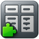

#  PropertyGridHelpers

**PropertyGridHelpers** is a utility library designed to simplify working with the .NET `PropertyGrid` control. It provides a suite of attributes, editors, converters, and helper classes to enhance the experience of editing object properties in UI environments — particularly useful for control development, debugging tools, and internal utilities.

---

## ✨ Features

- ✅ **Attribute-based configuration**  
  Easily configure how properties appear and behave in the `PropertyGrid`.

- 🎛 **Custom UITypeEditors**  
  Drop-in editors like combo boxes with autocomplete, image pickers, resource selectors, etc.

- 🔄 **TypeConverters**  
  Convert enums, file paths, and other types seamlessly.

- 🧩 **Extensible design**  
  Compose and reuse helper types without relying on custom controls or complex UI code.

---

## 📚 When to Use

**PropertyGridHelpers** is great for:

- Building internal configuration tools
- Developing custom WinForms controls
- Automating settings UI in debugging or administrative utilities
- Making test harnesses with minimal UI effort

---

## 🚀 Get Started

Install via NuGet:

```bash
dotnet add package PropertyGridHelpers
```
Or in your .csproj:

```xml
<PackageReference Include="PropertyGridHelpers" Version="1.1.0" />
```

## 📘 Documentation

Full documentation is available at:
https://github.com/dparvin/PropertyGridHelpers/wiki

## 📄 License
Licensed under the Apache 2.0 License.